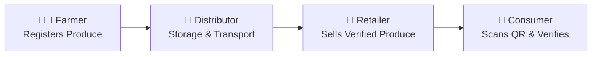

# 🌱 AgriChain – Blockchain-based Agricultural Supply Chain Management  

  
  
  
  

---

## 📑 Table of Contents
- [Overview](#-overview)
- [Key Features](#-key-features)
- [Project Workflow](#-project-workflow)
- [Tech Stack](#-tech-stack)
- [Getting Started](#-getting-started)
- [Future Enhancements](#-future-enhancements)
---

## 📌 Overview  
**AgriChain** is a **blockchain-powered supply chain solution** that ensures **transparency, traceability, and fairness** in the agricultural ecosystem.  
It enables **farmers, distributors, retailers, and consumers** to interact through a **secure, tamper-proof, and real-time system** ensuring fair trade, food authenticity, and efficient logistics.  

---

## ✨ Key Features  
✅ **Farmer Onboarding & Produce Registration** – Farmers can register crops with details like harvest date, type, and certifications.  
✅ **Blockchain Traceability** – Every step from **farm → distributor → retailer → consumer** is securely recorded.  
✅ **Fair Pricing via Smart Contracts** – Ensures direct payments to farmers without middlemen exploitation.  
✅ **Real-time Supply Chain Tracking** – APIs track storage, transport, and delivery.  
✅ **Consumer Verification** – Scan **QR codes** to check product origin and authenticity.  
✅ **Analytics Dashboard** – Monitor pricing, demand-supply trends, and logistics insights.  

---

## 🔗 Project Workflow  

AgriChain ensures **end-to-end traceability and transparency** in the agricultural supply chain.  

1. **Farmer Stage**  
   - Farmer registers crops on the platform.  
   - Uploads details like crop type, harvest date, certifications.  
   - A unique entry is recorded on the blockchain.  

2. **Distributor Stage**  
   - Collects produce from farmers.  
   - Updates storage, transport, and quality details.  
   - Blockchain records logistics data to avoid tampering.  

3. **Retailer Stage**  
   - Retailers receive verified produce from distributors.  
   - Products are assigned **QR codes** linked to blockchain entries.  
   - Ensures only authentic goods reach consumers.  

4. **Consumer Stage**  
   - Consumers scan the **QR code** on purchased items.  
   - Instantly view product origin, journey, pricing, and certifications.  
   - Builds trust by verifying authenticity before purchase.  

---

### 📊 Visual Workflow  



## 🏗️ Tech Stack  

- **Backend:** Node.js + Express.js  
- **Database:** MongoDB  
- **Blockchain:** Ethereum (Sepolia testnet), Solidity smart contracts (Hardhat, Ethers.js)  
- **Frontend (Future Scope):** HTML + TailwindCSS + Vanilla JS  
- **Deployment:** AWS  
- **Others:** QR Code Integration, REST APIs  

---

## 🚀 Getting Started  

### 1️⃣ Clone the Repository  
```bash
git clone https://github.com/S-SamarthBhatt-B/AgriChain.git
cd AgriChain
```

---

## 🔮 Future Enhancements  

- 📱 **Frontend Development** – Build a complete UI using **TailwindCSS + React** for better usability.  
- 📲 **Mobile Application** – A farmer-friendly Android/iOS app for crop registration & tracking.  
- 📊 **AI Integration** – Use AI/ML for **price prediction, demand forecasting, and yield analysis**.  
- 📑 **QR to PDF Generator** – Generate PDF receipts/reports embedded with product **QR codes** for consumers and retailers.  
- 🌐 **IoT Integration** – Connect IoT devices for **real-time monitoring of storage, transport, and environmental conditions**.  
- 🔐 **Role-based Authentication** – Enhanced security with **separate dashboards** for farmers, distributors, retailers, and consumers.  
- ☁️ **Cloud Scalability** – Scale backend on AWS/GCP for **high availability and global access**.  
